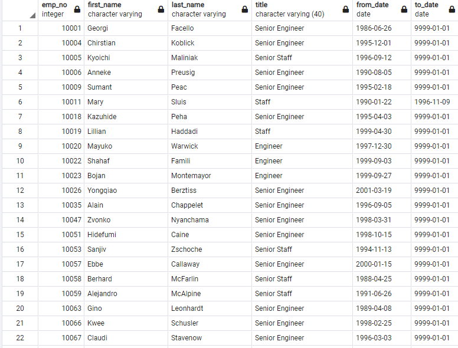
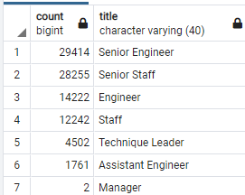
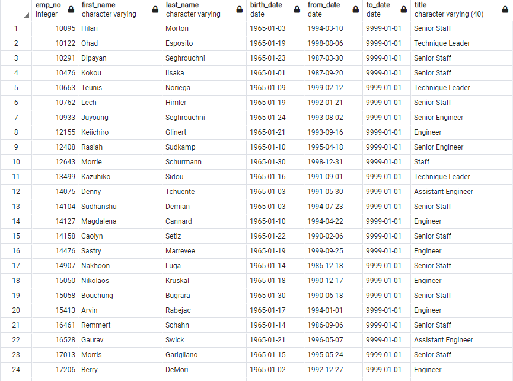
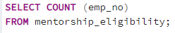

# Pewlett-Hackard-Analysis
UCB Module 7
## Overview of Project

The goal of this analysis is to look into the coming likely wave of retiring employees, identify their titles and departments, and find the potential members of a proposed mentorship program.  The purpose of that program is to keep some employees on in a part time role, to help train newer hires so the client does not lose the expertise that will be retiring out. Mass retirement periods can cause large disruption and loss of critical talent and experience; we aim to understand and soften that blow.

## Results

We have created a table showing employee ID number, birthday, first name, last name, and hire date. A seperate table was made counting the title of these potential retires. A third table shows prospective candidates for the mentorship program. All of this was pulled together from several existing data sets that the client provided. These tables are a list of potential upcoming retires, along with their titles, so we know what roles the client will need to fill.

• The unique_titles table shows us a list of the titles that will become vacant, along with the name and ID of the employee, shown below. The total number of retiring employees by our analysis is 90,399

• We also pulled a count of the number of each title that is retiring, shown below, which gives a good scope of the coming issue; many senior level positions are going to be retiring in the near future.

• Only 1,548 of the 90,399 likely retires are eligible for the mentorship program. 

• If the client is looking to retain much of it's experience to train the incoming hires and promotions, they may want to look into expanding this pool, as a team of 1,548 training for that many new positions means each mentor is responsible for over 58 new positions. This does not sound like a part time job, as described by the client.

## Summary

90,399 roles are likely to need to be filled, with new hires and promotions, to fill Pewlett Hackard's upcoming wave of retirements. 

   

As stated above, per the stipulated standards for eligibility for the retirement program, the workload for training the team members expected in these vacant roles is not small; each mentor would be mentoring upwards of 58 employees. The client should seek to expand this eligibility, or find alternate ways to ensure these new or promoted employees are able acquire the expertise and experience needed.

   

